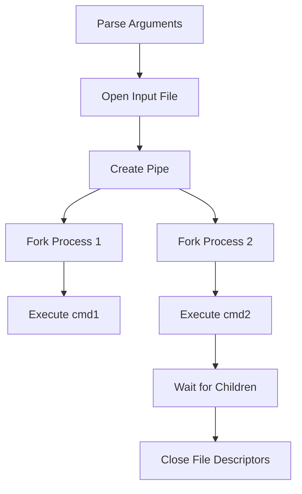

# pipex 🛠️ Unix Pipeline Emulator

## Project Description

### Core Purpose
Recreate shell piping behavior (`cmd1 | cmd2`) with input/output redirection from files. Handle command execution and process management like:
```bash
< infile cmd1 | cmd2 > outfile
```

### Key Technical Concepts
- **Process management**: Forking and process hierarchy
- **Inter-process communication**: Pipe system calls
- **File descriptor manipulation**: dup2/close operations
- **PATH resolution**: Finding executable binaries

### Why This Project Matters
Pipex provides crucial understanding of:
- Unix process creation and management
- Real-world pipe/redirection mechanics
- System programming fundamentals
- Error handling in concurrent execution

---

## Learning Objectives 🎯

### Key Programming Concepts
1. **Process Forking**:
   ```c
   pid = fork();
   if (pid == -1)
       error_exit("Fork failed");
   ```
2. **Pipe Management**:
   ```c
   int fd[2];
   pipe(fd);  // fd[0] read end, fd[1] write end
   ```
3. **Redirection Mechanics**:
   ```c
   dup2(input_fd, STDIN_FILENO);
   dup2(output_fd, STDOUT_FILENO);
   ```
4. **Command Execution**:
   ```c
   execve("/bin/ls", args, envp);
   ```

### Skills Developed
- System call error handling
- Resource management (file descriptors)
- Understanding Unix process trees
- PATH environment variable manipulation

### Technical Standards
```c
/* Typical process structure */
pid_t pid = fork();
if (pid == 0)
{ /* Child process */
    handle_io_redirection();
    execute_command();
}
waitpid(pid, &status, 0);
```
- **42 Requirements**:
  - Handle absolute vs relative paths
  - Support environment variables
  - No memory leaks
  - Program name must be pipex
- **Error Cases**:
  - Invalid arguments
  - Command not found
  - Permission denied
  - Pipe/fork failures

---

## Algorithm Overview 🔄

### Execution Flow


### Shell Comparison
| Shell Command          | pipex Equivalent                  |
|------------------------|-----------------------------------|
| `ls -l pipe wc -l`       | `./pipex infile "ls -l" "wc -l" outfile` |
| `< input grep foo > output` | `./pipex input "grep foo" "cat" output` |

---

## Installation & Usage 🛠️

1. **Compilation**
   ```bash
   make  # Creates pipex executable
   ```

2. **Basic Usage**
   ```bash
   ./pipex infile "cmd1 args" "cmd2 args" outfile
   ```

3. **Test Commands**
   ```bash
   # Compare with shell
   ./pipex infile "grep 'foo'" "wc -w" outfile
   < infile grep 'foo' | wc -w > outfile

   # Test error handling
   ./pipex invalid.txt "invalidcmd" "ls" outfile
   ```

4. **Bonus Features (Optional)**
   ```bash
   # Support multiple pipes
   ./pipex infile "cmd1" "cmd2" "cmd3" ... outfile

   # Here document support
   ./pipex here_doc LIMITER "cmd" "cmd1" outfile
   ```

---

## Error Handling 🚨

**Mandatory Error Messages**:
```c
// Example error management
void error_exit(char *msg) {
    perror(msg);
    exit(EXIT_FAILURE);
}
```
- Handle all system call errors (fork, pipe, open)
- Detect command not found (ENOENT)
- Verify file permissions
- Prevent zombie processes with proper waiting

---
